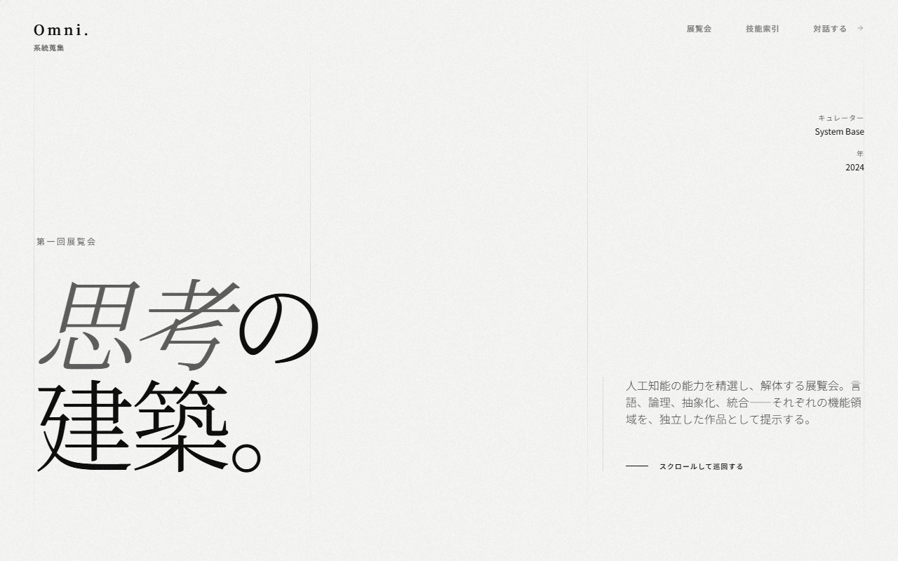
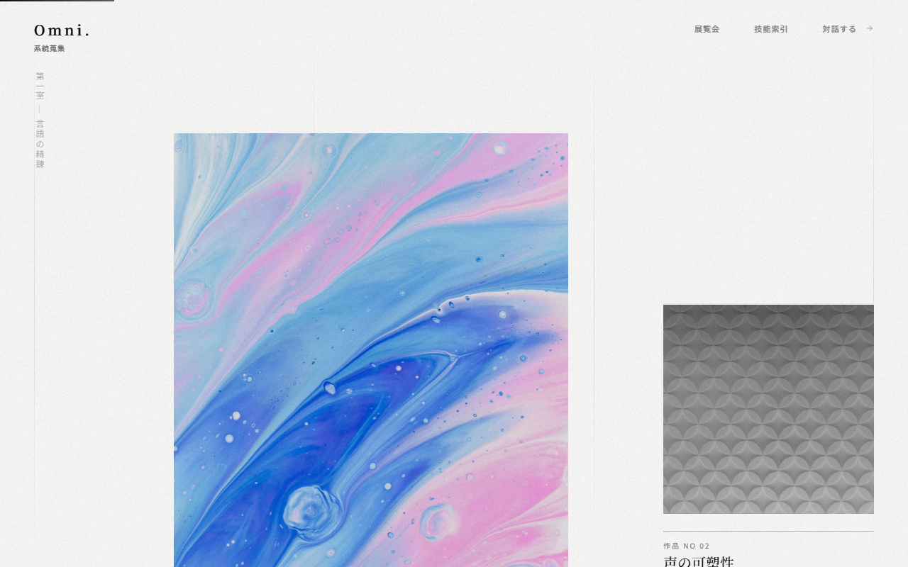
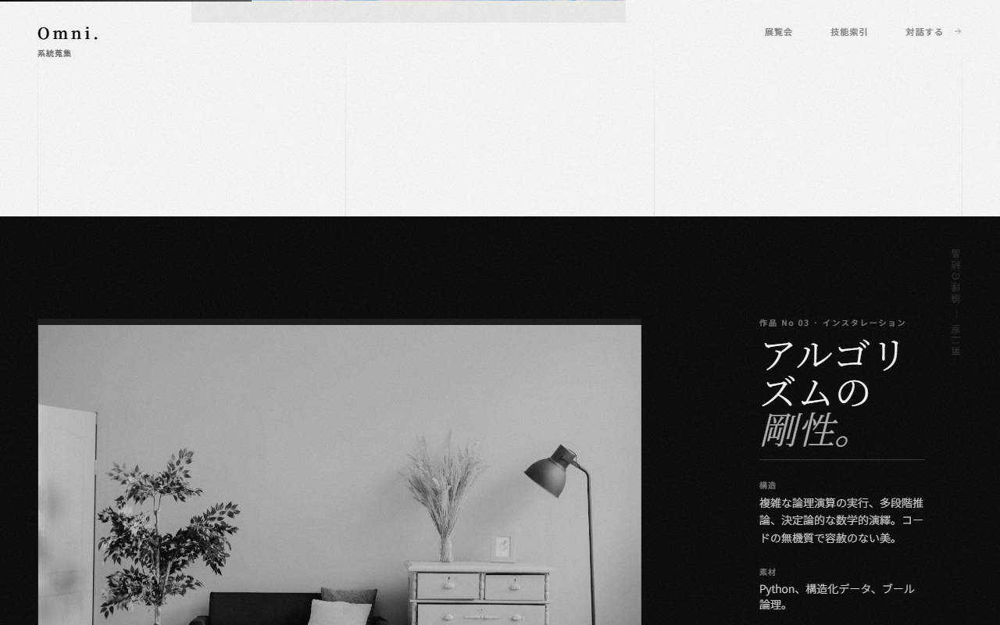
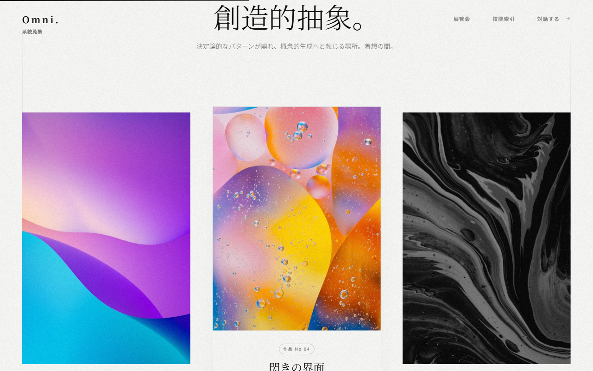
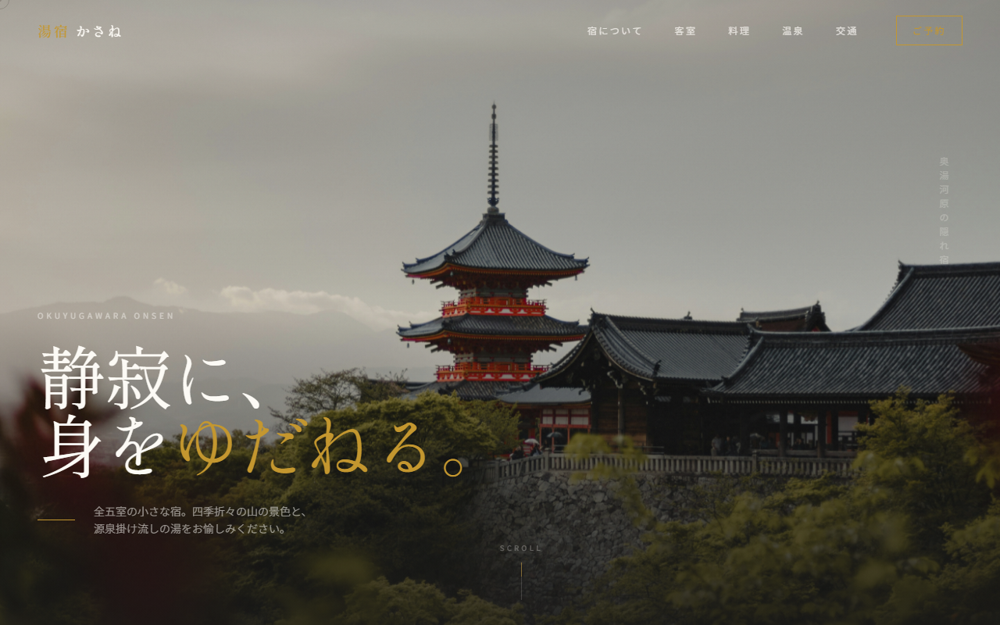
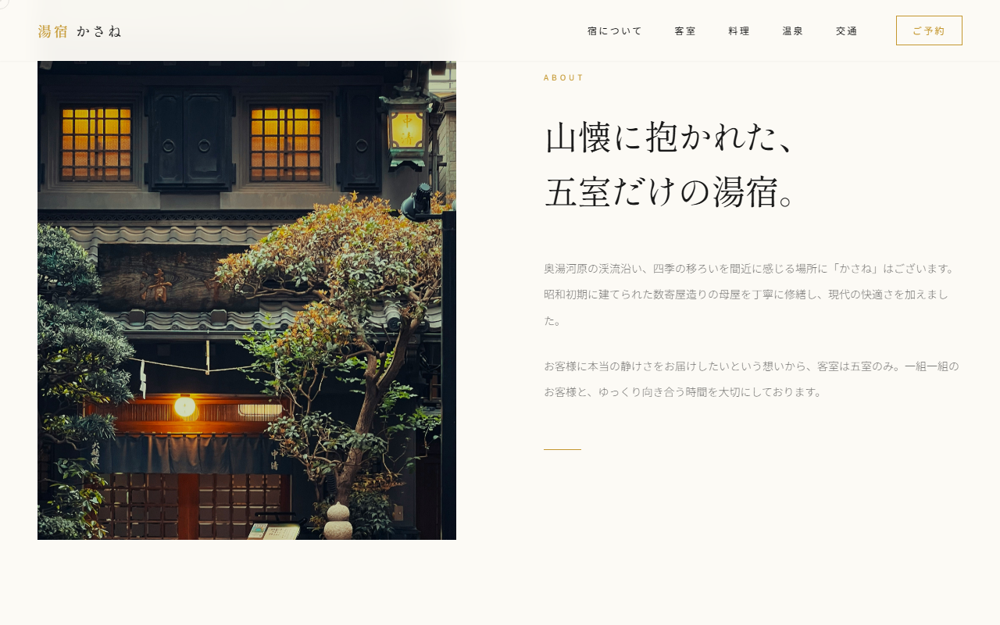
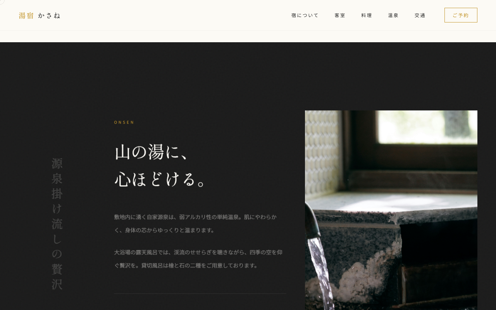
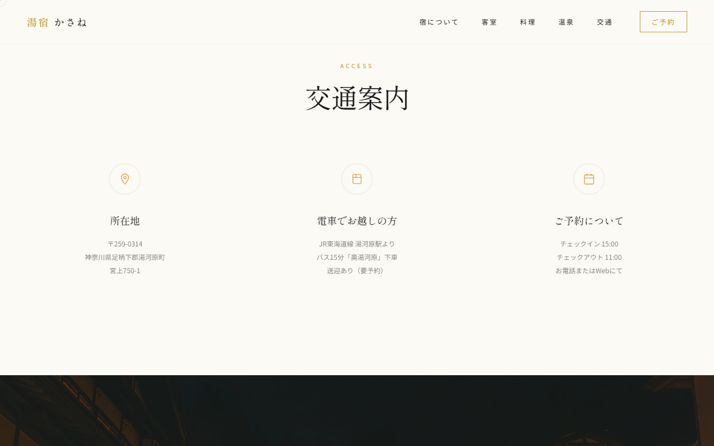

# Web Design Showcase

  
  
  

Webデザインの表現幅を示すテンプレート集。さまざまなスタイルのデザインテンプレートを制作・アーカイブしています。

**https://tatsunoritojo.github.io/web-design-showcase/**

## 収録テンプレート

### 美術テンプレート

美術館ギャラリー風UI。展覧会メタファーでスキルや能力を展示。カスタムカーソル、パララックス、3Dティルト等のアニメーション搭載。

| | |
|---|---|
|  |  |
|  |  |

### 旅館テンプレート

和風旅館のWebサイト。縦書きテキスト、伝統的な和の配色、余白を活かした構成。スクロールアニメーション搭載。

| | |
|---|---|
|  |  |
|  |  |

## 技術スタック

- HTML / CSS / JavaScript
- Tailwind CSS (CDN)
- GitHub Pages (ホスティング)

## ローカルで確認

静的HTMLのため、ブラウザで `index.html` を直接開くだけで動作します。
